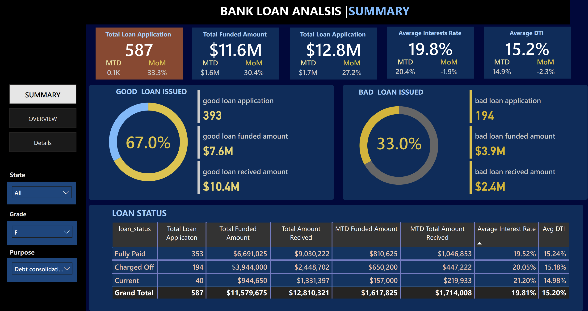
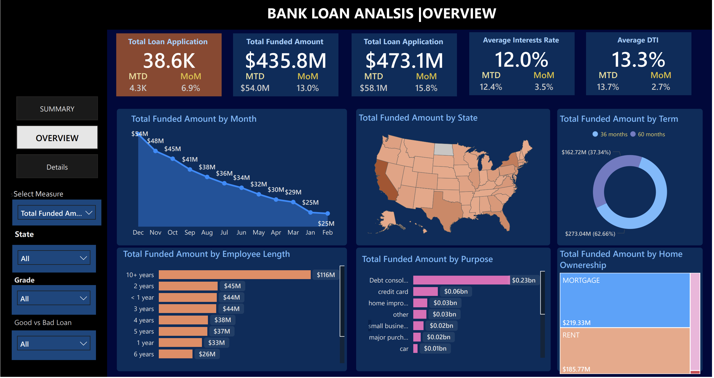
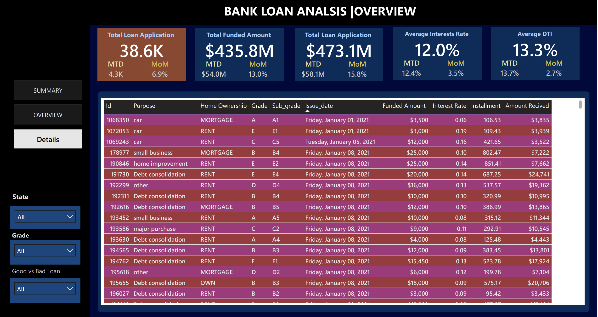

# 🏦 Bank Loan SQL Reporting & Dashboard Project

## 🛠️ Tools & Technologies Used

| Technology     | Purpose                                   |
|----------------|-------------------------------------------|
| 📊 Power BI     | Dashboard creation and visual storytelling |
| 🧮 SQL           | Metric calculation, filtering, and joins  |

---

## 📌 Overview

This project delivers a **comprehensive SQL reporting suite** and accompanying **Power BI dashboard** tailored for end-to-end analysis of bank loan portfolios. It enables users to extract, aggregate, and visualize **Key Performance Indicators (KPIs)** to monitor portfolio health, performance trends, and operational risk.

Built for **PostgreSQL** and designed to run smoothly on **pgAdmin 4 (Mac-friendly)**, this toolkit supports executive reporting, regulatory monitoring, and business intelligence integration.

---

## ✨ Key Features

- **📈 Dynamic KPI Reports**
  - Total, MTD, and PMTD loan application counts
  - Funded loan summaries (overall, MTD, MoM)
  - Payment stats (Received MTD, lifecycle-to-date)
  - Interest rate and Debt-to-Income (DTI) metrics

- **🎯 Loan Performance Analysis**
  - Segmentation into *Good* (Fully Paid/Current) vs. *Bad* (Charged Off)
  - KPI breakdowns by loan quality: counts, funds disbursed, payments received

- **🧠 Operational Insights**
  - Analysis by:
    - Loan Status
    - Issue Date
    - US State
    - Loan Term
    - Employee Tenure
    - Purpose of Loan
    - Home Ownership

- **⚙️ Ready-to-Run SQL Scripts**
  - Clean, well-documented PostgreSQL queries
  - Easily adaptable to your own `loan_data` schema

---

## 🖥️ Dashboard Preview

### 📌 Summary Page


### 📌 Overview Page


### 📌 Details Page


---

## 📌 Highlight Metrics

| Metric                          | Value             |
|--------------------------------|-------------------|
| **Total Loan Applications**     | 587               |
| **Total Funded Amount**         | $11.6M            |
| **Total Amount Received**       | $12.8M            |
| **MTD Funded Amount**           | $1.6M             |
| **MTD Received Amount**         | $1.7M             |
| **Average Interest Rate**       | 19.8% (MTD: 20.4%)|
| **Average DTI**                 | 15.2% (MTD: 14.9%)|

---

## ✅ Loan Quality Summary

| Loan Type | Applications | Funded Amount | Amount Received |
|-----------|--------------|----------------|------------------|
| **Good** (Fully Paid + Current) | 393          | $7.6M            | $10.4M           |
| **Bad** (Charged Off)           | 194          | $3.9M            | $2.4M            |

---

## 📈 Trend Insights

- **Monthly Funded Amount Trend:** December peak at **$54M**
- **Loan Term Split:**
  - 36 months → $273M (62.7%)
  - 60 months → $163M (37.3%)
- **Loan Purpose Breakdown:**
  - Debt Consolidation: $230M+
  - Other: Credit Card, Home Improvement, Small Business, etc.
- **By Home Ownership:**
  - Mortgage: $219.3M
  - Rent: $185.8M

---

## 🔍 Example SQL Query Snippets

```sql
-- Total Loan Applications
SELECT COUNT(*) AS Total_Loan_Applications FROM loan_data;

-- MTD Funded Amount (example for Dec 2021)
SELECT SUM(loan_amount) AS MTD_Funded_Loan
FROM loan_data
WHERE EXTRACT(MONTH FROM issue_date) = 12 AND EXTRACT(YEAR FROM issue_date) = 2021;

-- Good Loan Percentage
SELECT 
  COUNT(CASE WHEN loan_status IN ('Fully Paid', 'Current') THEN id END) * 100.0 / COUNT(id) AS Good_Loan_Percentage
FROM loan_data;
